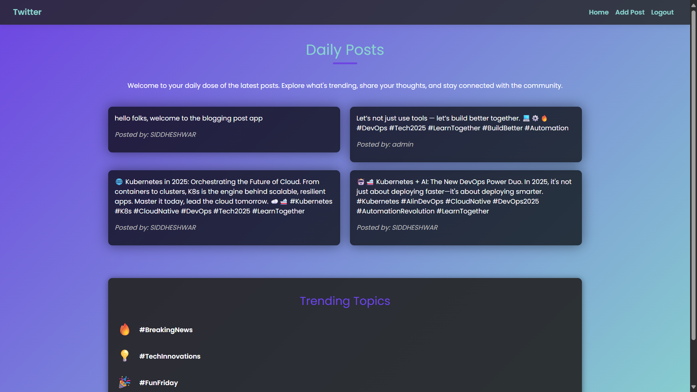

# FullStack Monolithic Blogging App - DevOps Integration

- A monolithic full-stack blogging application built using Spring Boot for the backend and a modern frontend framework.  
- This project showcases CRUD operations, user authentication, and a responsive UI for managing blog posts, all integrated into a single deployable unit.

---



---

## Features

- User authentication and authorization
- Create, Post and read blog posts

---

## Installation

1. Clone the repository:
    ```bash
    git clone https://github.com/your-username/FullStack-Blogging-App.git
    cd FullStack-Blogging-App
    ```

2.  Build Dockerfile & Run:
    ```bash
    docker build -t sidraut007/fullstack-blog-app .
    docker run -d -p 8000:8080  sidraut007/fullstack-blog-app
    ```

4. Access the application at `http://localhost:8000`.


## Contributing

Contributions are welcome! Please fork the repository and submit a pull request.
